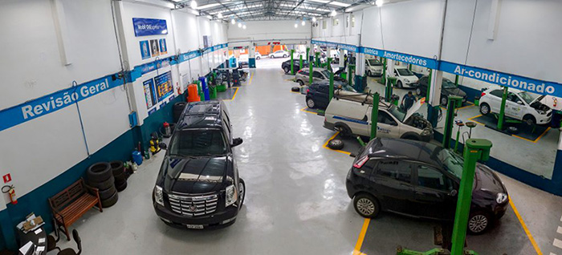

##### Componentes :

- Leonardo Gottardi,
- José Carlos,
- Arthur Miertschink,
- Felipe da Silva.
# Centro Automotivo MorePower

O Centro Automotivo MorePower trabalha com revisões básicas (troca de fluídos, rotação de pneus, checagem de lâmpadas) além de um diagnóstico geral da situação das peças, alinhamento e balanceamento, entre outros. Além disso trabalhamos com customização de veículos, ou seja, trocamos várias peças do veículo para deixá-lo de acordo com o gosto dos clientes. Outro serviço que fazemos é o de lanternagem e pintura, que consiste em reparar danos estruturais dos carros, desde um pequeno amassado até uma possível colisão.

Trabalhamos com pessoas físicas e pessoas jurídicas (normalmente Seguradoras), onde as pessoas jurídicas terão melhores condições de pagamento e descontos mais vantajosos, pois elas terão um contrato de parceria com a nossa oficina. 

Em nossa oficina contamos com três equipes, a equipe de mecânicos (que realiza os serviços no veículo, seja de manutenção ou funilaria), a equipe administrativa (responsável pelo controle de estoque e encomenda de peças e movimento do caixa), e por último a equipe de atendimento (que receberá os carros, fará o vistoria dos mesmos, além de anotar as requisições do cliente para entregar o carro aos mecânicos). O processo de vistoria consiste na checagem do carro quando o mesmo chega na ofcina, a fim de localizar pequenos defeitos pré-existentes não relacionados com o serviço.

Temos contato com fornecedores de peças, para caso o cliente não queira trazer as peças que serão instaladas no carro por conta própria. Outro fornecedor que temos é o de ferramentas e equipamentos, além disso todas as ferramentas (chaves para aperto, pistolas para pinturas, torquimetros para conferêmcia de aperto, multímetro, etc), elevadores e equipamentos (como scanners, multímetro, etc).

Precisamos de um sistema que armazene todos as vistorias dos carros, além de catalogar todas as ferramentas e equipamentos. O mesmo também fará um controle do estoque de insumos, além de armazenar todos os dados de nossos clientes, bem como os veículos que o mesmo traz a oficina. Os funcionários também serão registrados. Temos um serviço de avaliação que os clientes fazem ao final de cada serviço prestado. Por fim todas as ferramentas, elevadores e equipamentos precisam ser catalogados e ter um código para identificação.
 

  

